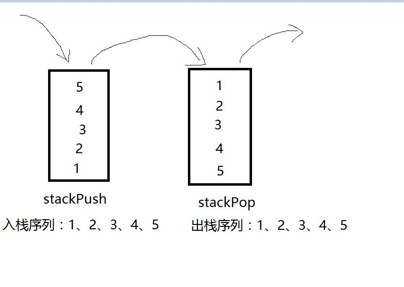

### 题目

> 用两个栈来实现一个队列，完成队列的Push和Pop操作。 队列中的元素为int类型。


### 思路

> 将一个栈作为压入栈 ( stackPush )，在压入数据时只往该栈压入，另外一个栈作为弹出栈，在弹出数据时只从这个栈弹出 ( stackPop )。
> 因为栈的特点是：先进后出，所以先将所有数据逐一压入 stackPush 栈中，然后再将所有数据从栈 stackPush 顶到栈底逐一压入到 stackPop 栈中，
> 当 stackPush 栈底的数据全部压入到 stackPop 中，然后再次将数据从栈 stackPop 顶到栈底逐一弹出所有数据，那么栈序列顺序和入栈序列就一样了。
> 注明：**所有的数据都要一次性的 push 和 pop**，其间不能够穿插进行操作；并且 stackPop 中之前不能有数据!

如下图就是大概思路草图：



则就将两个栈实现了一个队列，并有队列的 push 和 pop 操作。

### 代码

```
public class CreateQueue
{
    Stack<Integer> stackPush = new Stack<Integer>();
    Stack<Integer> stackPop = new Stack<Integer>();


    public void push(int node) {
        stackPush.push(node);
    }

    public int pop() {
        if (stackPop.empty() && stackPush.empty()) {
            throw new RuntimeException("Queue is empty");
        } else if (stackPop.empty()){   //stackPop中一开始不能够有数据
            while (!stackPush.empty()){
                stackPop.push(stackPush.pop());     //将stackPush中的数据push到stackPop中
            }
        }
        return stackPop.pop();
    }
}

```


